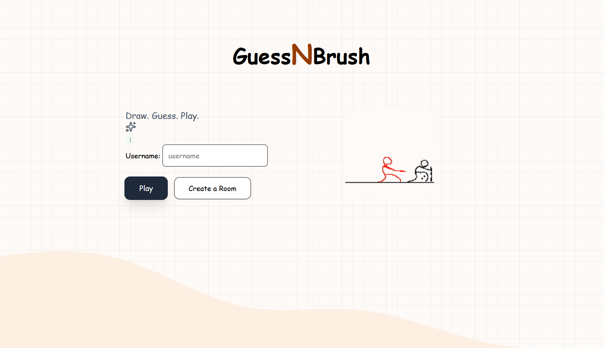

# GuessNBrush

A real-time multiplayer drawing and guessing game. Players take turns drawing a secret word while others race to guess it in the chat.

🔗 **[Live Demo](https://guess-n-brush.vercel.app/)**

---

## Tech Stack

- **Frontend** — React, Vite, Tailwind CSS
- **Backend** — Node.js, Express, Socket.io
- **Deployment** — Vercel (frontend), Render (backend)

---

## Features

- Public rooms — auto-matchmaking, game starts when 2+ players join
- Private rooms — create a room, share the code, host starts the game
- Real-time canvas sync — brush, eraser, flood fill, clear tools
- Word selection with 30s auto-pick if drawer is idle
- 80s turn timer with progressive hint reveals at 60s, 40s, 20s
- Score system — faster guesses earn more points
- Host reassignment when host disconnects
- Live online player counter

---

## Run Locally

**Clone the repo**
```bash
git clone https://github.com/Abhigyan2005/GuessNBrush
cd GuessNBrush
```

**Backend**
```bash
cd Backend
npm install
```

```bash
npm run start
```

**Frontend**
```bash
cd Frontend
npm install
```

```bash
npm run dev
```

Open `http://localhost:5173` in two tabs and join the same room to test.

---

## Project Structure

```
guessnbrush/
├── Backend/
│   ├── index.js             # Express + Socket.io setup
│   ├── socketHandler.js     # All socket event handlers
│   ├── roomManager.js       # Room and player state
│   ├── gameManager.js       # Turn logic, timer, scoring
│   └── utilities/
│       ├── words.js         # 2000+ word bank
│       └── generateRoomId.js
│
└── Frontend/
    └── src/
        ├── pages/
        │   ├── Landing.jsx
        │   └── GameRoom.jsx
        ├── components/
        │   ├── Canvas.jsx
        │   ├── ChatPanel.jsx
        │   ├── PlayerList.jsx
        │   ├── Board.jsx
        │   ├── WordSelectionModal.jsx
        │   ├── Leaderboard.jsx
        │   └── ...
        └── utilities/
            ├── socket.js    # Singleton socket instance
            └── CanvasTool.js
```

---

## Screenshots


---

